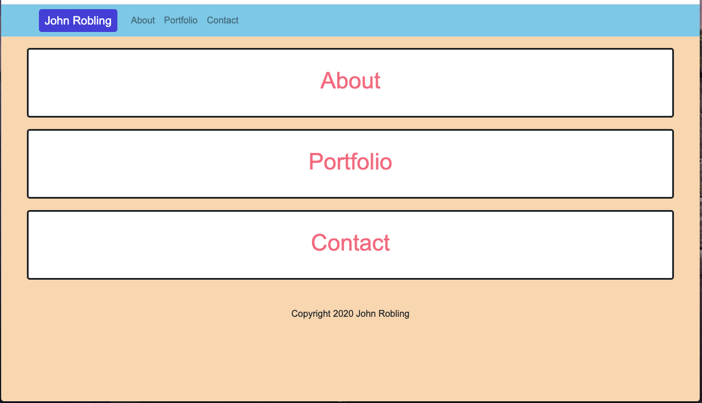

# John Robling Portfolio

## Description

This site contains John Robling's project portfolio and contact information.

## Installation
    
1. pull repo to local machine
2. run npm install
3. run npm start
4. go to http://localhost:3000/ to view the site

## Usage

[Deployed Site](https://jonhroblingportfolio.herokuapp.com/)

## Contributing

Please no not contribute to my portfolio.

## Questions
If you have any questions, you can email me directly at roblingjohn@gmail.com. 
Please visit my GitHub page at [roblingjohn](http://github.com/roblingjohn).
        